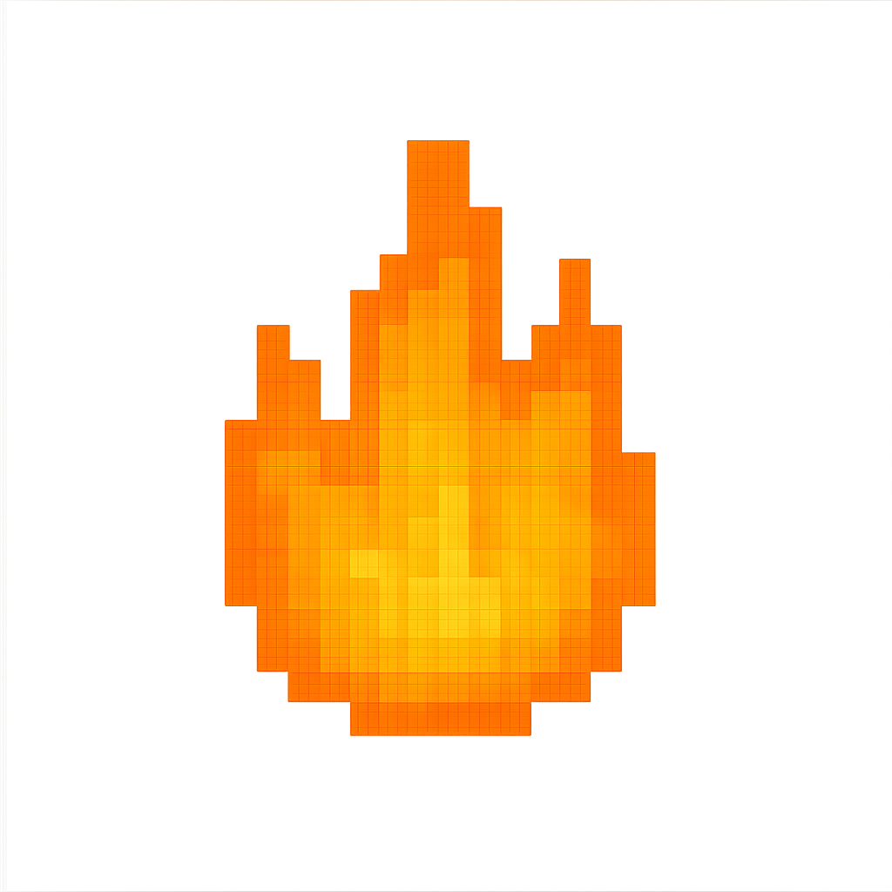

# Flare

<p align="center">
  
</p>

**Starter Templates for Fern UI Framework**

Flare is a repository of starter Fern projects and templates that users can install via the Terra CLI. These templates provide ready-to-use Fern projects for various use cases.

## What is Flare?

Flare provides starter templates for:

- **Game Development**: Game loop, input handling, graphics
- **Dashboard Applications**: Data visualization, charts, admin panels
- **Creative Applications**: Graphics, animations, artistic tools

## Quick Start

### Installation
```bash
# Flare templates are available when you install Fern
git clone https://github.com/fernkit/fern.git
cd fern
./install.sh

# Terra CLI provides access to templates
fern templates list
```


## Templates

### Game Starter
A complete space shooter game demonstrating game development with Fern.

**Features:**
- Player movement with WASD/arrow keys
- Shooting system with space bar
- Enemy AI with collision detection
- Score system and game over mechanics
- Physics simulation for bullets and enemies

**Use Cases:** 2D games, arcade-style games, educational game development

### Dashboard Starter
A comprehensive analytics dashboard with data visualization.

**Features:**
- KPI metric cards with change indicators
- Bar charts and pie charts for data visualization
- Activity feed with recent events
- Responsive dashboard layout
- Sample data structures

**Use Cases:** Business dashboards, admin panels, analytics tools, monitoring systems

### Creative Starter
A generative art canvas with particle systems and animations.

**Features:**
- Dynamic particle system with physics
- Trail effects and color cycling
- Procedural animation patterns
- Geometric shape animations
- HSV color space manipulation

**Use Cases:** Creative applications, digital art, visualizations, screensavers

## Template Structure

Each template includes:
- **README.md**: Detailed documentation and usage instructions
- **lib/main.cpp**: Full-featured example implementation
- **fern.yaml**: Project configuration
- **assets/**: Resource folder for images, fonts, etc.
- **web/**: Web platform files
- **linux/**: Linux platform files

## Contributing

To add a new template:
1. Create a new Fern project: `fern sprout template-name`
2. Implement your template features
3. Add comprehensive documentation
4. Submit a pull request to the Flare repository

## Support

For questions and support:
- [Fern Documentation](https://fern-lang.org)
- [GitHub Issues](https://github.com/your-repo/flare/issues)
- [Community Forum](https://fern-lang.org/community)

## License

MIT License - see LICENSE file for details.
